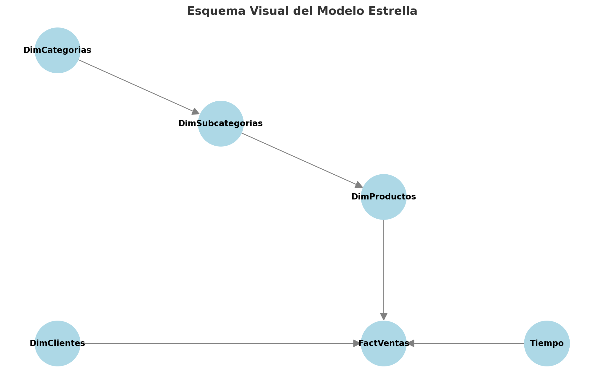

# Data Warehouse Project

Este repositorio contiene un proyecto de Data Warehouse desarrollado utilizando SQL Server y SSIS, con el objetivo de consolidar datos provenientes de un entorno de staging y automatizar procesos ETL para poblar un modelo estrella. 

---

## **Descripción del Proyecto**

Este proyecto está diseñado para demostrar las mejores prácticas en la creación y administración de un Data Warehouse, incluyendo:

- Modelado estrella con dimensiones y hechos.
- Automatización de procesos ETL mediante SSIS (SQL Server Integration Services).
- Uso de procedimientos almacenados para garantizar la integridad y eficiencia en la carga de datos.

El objetivo principal es poblar el Data Warehouse con información proveniente de vistas en una base de datos de staging y realizar transformaciones necesarias para alimentar el modelo estrella.

---

## **Estructura del Repositorio**

```plaintext
DataWarehouse_Project/
├── README.md                # Documentación principal del proyecto
├── Backups/                 # Backups de las bases de datos
│   ├── AdventureWorks2022.bak
│   ├── DataWarehouse_PT.bak
├── SQL_Scripts/             # Scripts SQL del proyecto
│   ├── DDL.sql              # Creación de tablas (Data Warehouse)
│   ├── Vistas.sql           # Creación de vistas (Stage)
│   ├── Procedimientos.sql   # Procedimientos almacenados (ETL)
├── SSIS_Project/            # Proyecto SSIS completo
│   ├── Project_SSIS.sln
│   ├── Project_SSIS/        # Carpeta del proyecto SSIS
│       ├── Poblar_DW.dtsx
│       ├── Project.params
│       ├── Project_SSIS.dtproj
├── Images/                  # Capturas de pantalla explicativas
│   ├── Diagrama_Modelo.png  # Diagrama del modelo estrella
│   ├── Resultado_Datos.png  # Ejemplo de datos en el DW
├── LICENSE                  # Licencia del proyecto (opcional)
└── .gitignore               # Archivos y carpetas a ignorar en Git
```

---

## **Requisitos Previos**

Para implementar este proyecto, asegúrate de tener instalados los siguientes programas:

- SQL Server Management Studio (SSMS).
- Visual Studio con las herramientas de SSIS.
- SQL Server Integration Services.

---

## **Instrucciones para Usar el Proyecto**

### **1. Restaurar Bases de Datos**

1. Descarga los archivos de backup desde la carpeta `Backups/`.
2. Restaura las bases de datos en SQL Server utilizando SSMS.
   - **AdventureWorks2022.bak**: Base de datos de origen.
   - **DataWarehouse_PT.bak**: Base de datos del Data Warehouse.

### **2. Ejecutar Scripts SQL**

1. Ve a la carpeta `SQL_Scripts/`.
2. Ejecuta los scripts en el siguiente orden:
   - `DDL.sql`: Crea las tablas del Data Warehouse.
   - `Vistas.sql`: Genera las vistas necesarias en la base de staging.
   - `Procedimientos.sql`: Crea los procedimientos almacenados para cargar las tablas del modelo estrella.

### **3. Configurar y Ejecutar el Proyecto SSIS**

1. Abre el archivo `Project_SSIS.sln` en Visual Studio.
2. Configura la conexión a las bases de datos en los parámetros del proyecto:
   - **Stage**: Base de datos de staging.
   - **DataWarehouse_PT**: Base de datos del Data Warehouse.
3. Ejecuta el paquete `Poblar_DW.dtsx` para automatizar el proceso ETL.

---

## **Diagrama del Modelo Estrella**

El siguiente es un diagrama del modelo estrella utilizado en el Data Warehouse:



- **Fact Table:** Tabla de hechos central que contiene datos transaccionales.
- **Dim Tables:** Tablas de dimensiones que enriquecen los hechos con atributos descriptivos.

---

## **Licencia**

Este proyecto está licenciado bajo la [MIT License](LICENSE). Puedes usarlo y modificarlo libremente, siempre y cuando menciones al autor.

---

## **Autor**

Creado por: **Enzo Ruiz Diaz**
- [LinkedIn](https://www.linkedin.com/in/enzo-ruiz-diaz/)
- [GitHub](https://github.com/tu-usuario/)

